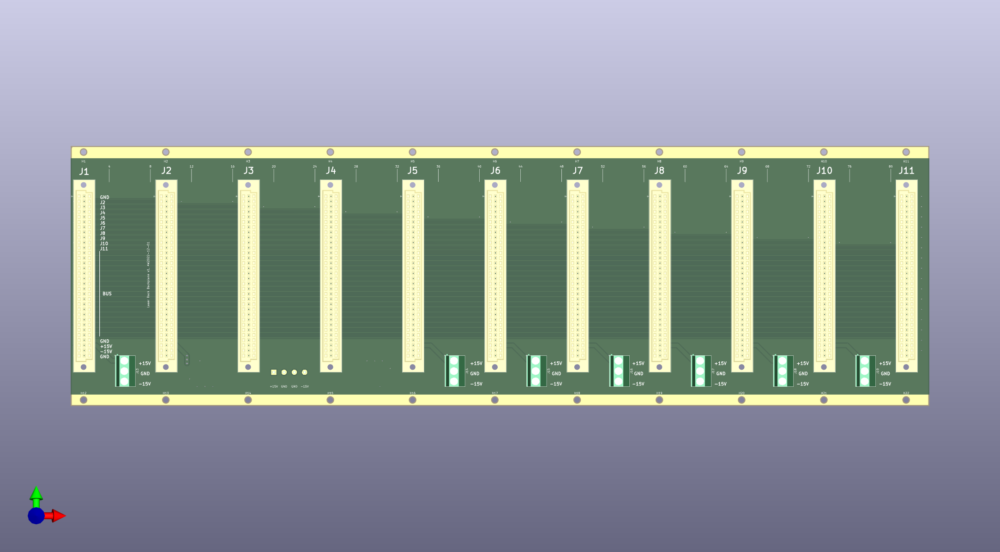

# BackPlane
19" 3U 84HP backplane used with Schroff subracks (might work with other brands also)

Fits 10pcs boards with 8HP front-panels and one board with 4HP panel (rightmost).

* connector: DIN41612, type C, 64 pins in rows a+c
* +15V/GND/-15V supply shared between all boards
* 17+17pin bus shared between all boards
* 2pins board-specific, all routed to slot-1 (J1, leftmost)

Backplane connector, Digikey 1195-1175-ND, Harting 09032646824, https://b2b.harting.com/09032646824

PCB RA connector, Digikey 1195-1149-ND, Harting 09031646921, https://b2b.harting.com/09036642921

